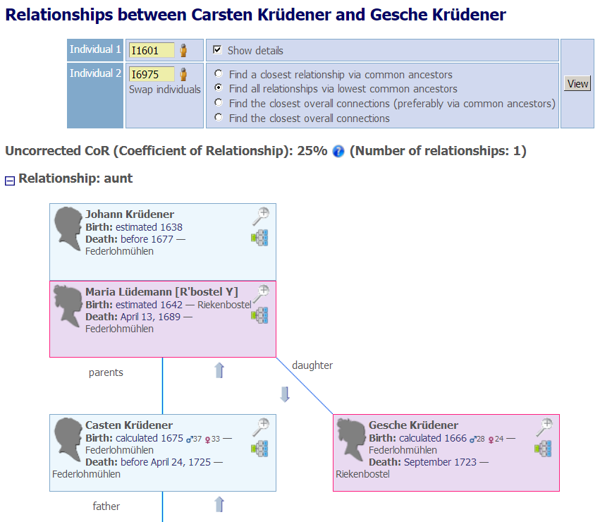
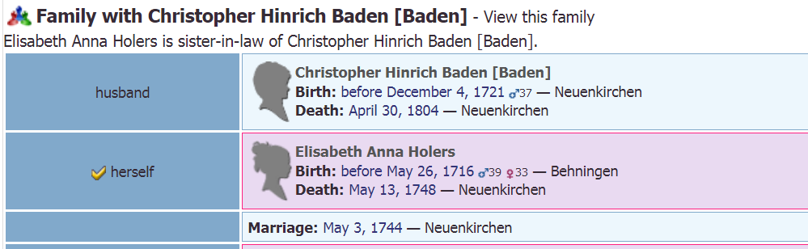
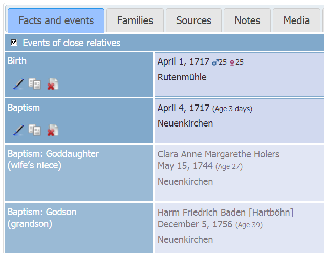

# Webtrees Custom Module: ⚶ Extended Relationships

This [webtrees](https://www.webtrees.net/) custom module offers a replacement for the 'Relationships' chart, implements hooks of the extended 'Families' tab, and of the extended 'Facts and Events' tab.
The project’s website is [cissee.de](https://cissee.de).

## Contents

* [Features](#features)
* [Demo](#demo)
* [Download](#download)
* [Installation](#installation)
* [License](#license)

### Features<a name="features"/>

* The extended relationship chart provides additional options for calculating reationships. Common ancestors are included in the relationship path.

* The module uses proper German relationship names, following [the German kinship system](https://de.wikipedia.org/wiki/Verwandtschaftsbeziehung#/media/File:European_kinship_system_de.svg) rather than using direct translations of [the system used in the English-speaking world](https://en.wikipedia.org/wiki/Family#/media/File:Relatives_Chart.svg): E.g. "Urgroßonkel 2. Grades" instead of "Cousin 3. Grades in aufsteigender Folge".
* In the extended 'Families' tab, the relationship to the default individual is displayed, as well as prior relationships between married individuals. The latter are calculated relative to the date of the marriage (to avoid the trivial relationship husband/wife), which allows us to show e.g. that someone married his brother's wife's sister.

* In the extended 'Facts and Events' tab, relationships to associated individuals are calculated similarly (relative to the date of the event).	
* Most features are configurable via module administration.
* The extended 'Facts and Events' tab, even when used standalone (without this module), fixes [Webtrees issue #1192](https://github.com/fisharebest/webtrees/issues/1192). When 'Events of close relatives' are activated, the inverse associations and relationships are also displayed:

### Demo<a name="demo"/>

See the <a href="./webtrees">[Müller Family tree](https://cissee.de/webtrees).

### Download<a name="download"/>

* Current version: 1.7.9.16
* Based on and tested with webtrees 1.7.9, may also work with older 1.7.x versions.
* Requires the Hooks module ('hooks_repackaged', or the original Hooks module via webtrees-geneajaubart). 
* Requires the 'vesta_common_lib' module.
* Displays data via the 'families_with_hooks' module. 
* Displays data via the 'personal_facts_with_hooks' module. 
* Download the zipped module, including all related modules, [here](https://cissee.de/vesta.latest.zip).
* Support, suggestions, feature requests: <ric@richard-cissee.de>. See also [this webtrees forum thread](https://www.webtrees.net/index.php/en/forum/4-customising/31587-extended-relationships-module-feature-requests).
* Issues also via <https://github.com/ric2016/extended_relationships/issues>

### Installation<a name="installation"/>

* Unzip the files and copy them to the modules_v3 folder of your webtrees installation. All related modules are included in the zip file. It's safe to overwrite the respective directories if they already exist (they are bundled with other custom modules as well), as long as other custom models using these dependencies are also upgraded to their respective latest versions.
* Enable the extended 'Families' module via Control Panel -> Modules -> Module Administration -> Families.
* Enable the extended 'Facts and Events' module via Control Panel -> Modules -> Module Administration -> Facts and Events.
* Enable the main module via Control Panel -> Modules -> Module Administration -> Extended Relationships. After that, you may configure several options.
* Enable the Hooks module via Control Panel -> Modules -> Module Administration -> Hooks. Make sure all hooks are selected (in the preferences of the Hooks module).
* Configure the visibility of the old and the extended 'Families' tab via Control Panel -> Modules -> Tabs (they both appear as 'Families' here - usually, you'll want to use only one of them. You may just disable the old 'Families' module altogether).		
* Configure the visibility of the old and the extended 'Facts and Events' tab via Control Panel -> Modules -> Tabs (they both appear as 'Facts and Events' here - usually, you'll want to use only one of them. You may just disable the old 'Facts and Events' module altogether).

### License<a name="license"/>

* **extended_relationships: a webtrees custom module**
* Copyright (C) 2016 to 2018 Richard Cissée
* Derived from **webtrees** - Copyright (C) 2010 to 2016  webtrees development team.
* Derived from **webtrees-geneajaubart** - Copyright (C) 2009 to 2016  Jonathan Jaubart.
* French translations provided by Michel Rivière.
* Dutch translations provided by Frans Weber.

This program is free software: you can redistribute it and/or modify
it under the terms of the GNU General Public License as published by
the Free Software Foundation, either version 3 of the License, or
(at your option) any later version.

This program is distributed in the hope that it will be useful,
but WITHOUT ANY WARRANTY; without even the implied warranty of
MERCHANTABILITY or FITNESS FOR A PARTICULAR PURPOSE. See the
GNU General Public License for more details.

You should have received a copy of the GNU General Public License
along with this program. If not, see <http://www.gnu.org/licenses/>.
